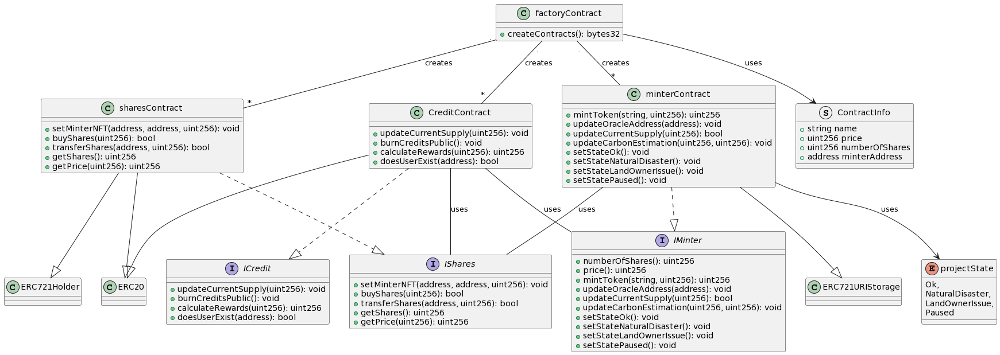
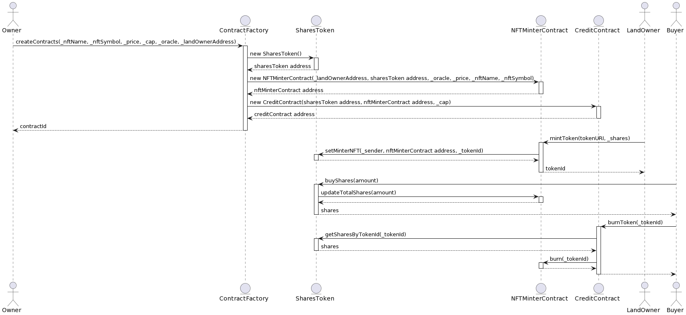

# Axon protocol
> This project is the source code of axon protocol which contains:
- Smart contract logic
- Frontend layout and logic

## Table of Contents
- [Prerequisites](#prerequisites)
- [Installation](#installation)
- [Software Modelling and Design Patterns](#software-modelling-and-design-patterns)
- [Deployment](#deployment)
    - [Locally](#1.locally)
    - [Custome Netwrok](#2.custome-network)
- [Verify](#verify)
- [Testing](#testing)


## Prerequisites

-node:16.x0

-hardhat: ^2.12

-Solidity v0.8.4 


## Installation

### Clone Repo
```bash
# Clone the repository
git clone https://github.com/Nameer-Alkhayyat/axon-dapp.git

# For smart contracts development, in the root folder:
npm install

# For frontend development:
cd frontend
npm install
```
## Software Modelling and Design Patterns

### Class DigramUML


### Sequence Digram



## Deployment

#### 1.Locally : 

---
**NOTE**

The follwing command will depoly the Factory Contract on Hardhat local node.

---
```bash  
npx hardhat run scripts/deploy.ts
  # The above command will also create a factoryContractAddress.tsx file where are the newly created Factory contract addresses will be saved.
 ```

 #### 2.Custome Network :
---
**NOTE**

The follwing command will depoly the Factory Contract on a remote network of your chioce. Make sure to provide netwrok_url and account secerts to env-var before trying to deploy on custome or remote networ network

---

 ```bash
  npx hardhat run scripts/deploy.ts --network NETWORKNAME 

  # The above command will also create a factoryContractAddress.tsx file where the newly created Factory contract addresses will be saved.
  ```


To create an instance of minterContract, sharesContract and creditContract from the factoryContract, run the following:

> Make sure to copy the factory Contract Address from factoryContractAddress.tsx file, in the root folder, to your .env file.


 ```bash
  npx hardhat run scripts/createContracts.ts

  # The above command will aslo contracts-addresses.tsx file where are the new created contract addresses and projectId will be saved.
  ```


## Verify

Verify contract automatically using etherscan

``` bash 
npx hardhat --network NETWORKNAME verify CONTRACTADDRESS
```


## Test

1. ``` npx hardhat test ```

2. Check test coverage ``` npx hardhat coverage ```
